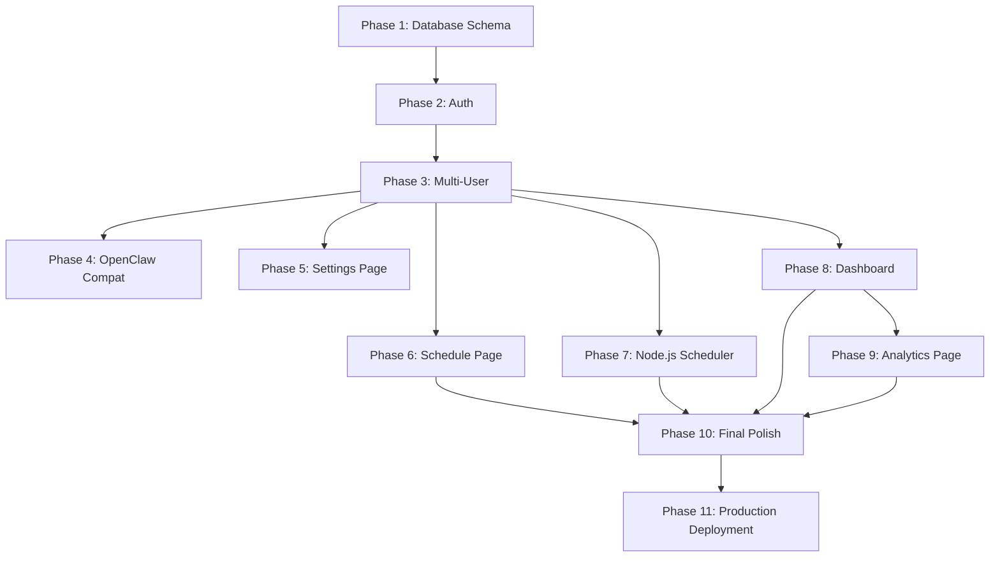

# Linkie Claw — Production Roadmap Overview

## Current Architecture Snapshot

| Layer | Technology | Status |
|-------|-----------|--------|
| **Frontend** | Next.js 16, React 19, TypeScript 5, Tailwind CSS 4, Shadcn UI | ✅ Complete |
| **Backend** | Next.js API routes, Zod validation | ✅ Complete |
| **Database** | SQLite (`better-sqlite3`) + Drizzle ORM (8 tables, user-scoped) | ✅ Complete |
| **AI (Text)** | Anthropic Claude (`claude-sonnet-4-20250514`) with 6 voice tones | ✅ Complete |
| **AI (Images)** | Google Gemini Flash / Replicate FLUX Schnell with 6 image styles | ✅ Complete |
| **Image Storage** | Cloudflare R2 (S3-compatible) — ephemeral previews, R2 on save | ✅ Complete |
| **Scheduler** | Node.js cron route (`/api/cron/publish-scheduled`) every 60s | ✅ Complete |
| **Publishing** | n8n workflow → LinkedIn API (OAuth 2.0), multi-user | ⚠️ n8n integration test pending |
| **Auth** | Auth.js v5 (JWT), Google + GitHub OAuth, Drizzle adapter | ✅ Complete |
| **Deployment** | Local development only | ❌ Phase 11 |

---

## Existing Pages & Routes

| Route | Page | Data Source | Status |
|-------|------|-------------|--------|
| `/` | Dashboard | Real DB via `/api/dashboard` | ✅ Live |
| `/calendar` | Content Calendar | Real DB via `/api/posts` | ✅ Live |
| `/create` | AI Writer / Studio | Real AI APIs + DB, 6 voice tones + 6 image styles | ✅ Live |
| `/analytics` | Analytics | Real DB via `/api/analytics` | ✅ Live |
| `/settings` | Settings | Real DB via `/api/settings` | ✅ Live |
| `/voice-tones` | Voice & Tones | Real DB (user-customizable) | ✅ Live |
| `/image-styles` | Image Styles | Real DB (user-customizable) | ✅ Live |
| `/login` | Login | Auth.js (Google + GitHub OAuth) | ✅ Live |

---

## Database Schema (8 Tables — User-Scoped)

**Auth tables:** `users`, `accounts`, `sessions`, `verificationTokens`
**App tables:** `posts`, `generations`, `userSettings`, `linkedinOauthStates`

- `posts`: `id`, `user_id`, `title`, `content`, `image_url`, `scheduled_at`, `published_at`, `status` (draft/scheduled/publishing/published/failed), `linkedin_post_urn`, `error_message`, `retry_count`, `created_at`, `updated_at`
- `generations`: `id`, `user_id`, `idea`, `text_variations_json`, `images_json`, `selected_text_id`, `selected_image_id`, `created_at`
- `userSettings`: `id`, `user_id`, LinkedIn profile/OAuth fields, `voice_tones_json`, `image_styles_json`, timestamps
- `linkedinOauthStates`: `state`, `user_id`, `expires_at`

> All app tables are scoped by `user_id`. Every DB query filters by authenticated user.

---

## Roadmap Phase Files

- Phase 0: [00-overview.md](./00-overview.md) (this file)
- Phase 1: [01-database-schema.md](./01-database-schema.md)
- Phase 2: [02-auth.md](./02-auth.md)
- Phase 3: [03-multi-user.md](./03-multi-user.md)
- Phase 4: [04-openclaw-compat.md](./04-openclaw-compat.md)
- Phase 5: [05-settings-page.md](./05-settings-page.md)
- Phase 6: [06-schedule-page.md](./06-schedule-page.md)
- Phase 7: [07-node-scheduler.md](./07-node-scheduler.md)
- Phase 8: [08-dashboard.md](./08-dashboard.md)
- Phase 9: [09-analytics-page.md](./09-analytics-page.md)
- Phase 10: [10-final-polish.md](./10-final-polish.md)
- Phase 11: [11-production-deployment.md](./11-production-deployment.md)
- Phase 12: [12-voice-and-tones.md](./12-voice-and-tones.md)

---

## Key Files Map

```
src/
  app/
    page.tsx                → Dashboard (real DB data via /api/dashboard)
    calendar/page.tsx       → Calendar (real DB via /api/posts)
    create/page.tsx         → AI Writer (real AI + DB, voice tones + image styles)
    analytics/page.tsx      → Analytics (real DB via /api/analytics)
    settings/page.tsx       → Settings (real DB via /api/settings)
    voice-tones/page.tsx    → Voice & Tones (user-customizable)
    image-styles/page.tsx   → Image Styles (user-customizable)
    login/page.tsx          → Login (Google + GitHub OAuth)
    layout.tsx              → Root layout (SessionProvider wrapper)
    api/
      posts/route.ts        → GET/POST posts (user-scoped)
      posts/[id]/route.ts   → GET/PUT/DELETE single post (user-scoped)
      posts/[id]/schedule/  → POST schedule a post
      posts/[id]/unschedule/→ POST unschedule
      posts/recover/        → POST recover failed/stale posts
      generate/text/        → AI text generation (6 voice tones)
      generate/image/       → AI image generation (6 image styles)
      images/upload/        → POST upload selected image to R2
      cron/publish-scheduled/ → GET cron endpoint (CRON_SECRET auth)
      dashboard/            → GET dashboard stats
      analytics/            → GET analytics data
      settings/             → GET/PUT user settings
      webhooks/publish-status/ → n8n callback
  components/
    layout/sidebar.tsx      → Navigation (all pages active)
    layout/user-card.tsx    → Session user identity
    dashboard/              → Dashboard components (real data)
    calendar/               → Calendar components
    analytics/              → Analytics components
    studio/                 → AI Writer/Studio components
    voice-tones/            → Voice tones editor
    image-styles/           → Image styles editor
    settings/               → Settings components
  lib/
    db/schema.ts            → Drizzle schema (8 tables, user-scoped)
    db/queries.ts           → All DB queries (user_id filtering)
    api/                    → AI provider clients (anthropic, gemini, replicate)
    storage/r2.ts           → Cloudflare R2 image storage
    auth.ts                 → Auth.js v5 config
    voice-tones.ts          → Voice tone definitions & validation
    image-styles.ts         → Image style definitions & validation
    validations/            → Zod request schemas
  middleware.ts             → Route protection (session check)
  scripts/
    dev-scheduler.ts        → Dev cron trigger (calls /api/cron every 60s)
```

---

## Phase Dependency Order

The 11 phases execute in the following sequence:



| Phase | Depends On | Why |
|-------|-----------|-----|
| 1. Database Schema | — | Define ALL tables and schema changes upfront (auth, user_id, settings, oauth_states, indexes) |
| 2. Auth | Phase 1 | Implement Auth.js v5 using tables from Phase 1 |
| 3. Multi-User | Phase 2 | Implement queries and middleware using `user_id` columns from Phase 1 |
| 4. OpenClaw Compat | Phase 3 | Needs final page structure to annotate |
| 5. Settings Page | Phase 3 | Implement UI using `user_settings` table from Phase 1 |
| 6. Schedule Page | Phase 3 | Needs user-scoped posts for calendar fixes + edit modal |
| 7. Node.js Scheduler | Phase 3 | Needs user context in scheduler |
| 8. Dashboard | Phase 3 | Needs user context for per-user analytics |
| 9. Analytics Page | Phase 8 | Extends dashboard patterns to dedicated page |
| 10. Final Polish | Phases 6, 7, 8, 9 | Audits everything after all features built |
| 11. Production Deployment | Phase 10 | SQLite→PostgreSQL + deploy + n8n production setup |

---

## Global Technical Decisions

These decisions apply across ALL phases:

### Database Migration: SQLite → PostgreSQL
- **Why:** SQLite is file-based and cannot run on most cloud platforms' serverless functions. PostgreSQL is the standard production database.
- **How:** Rewrite `drizzle.config.ts` to target PostgreSQL, update schema imports from `drizzle-orm/sqlite-core` to `drizzle-orm/pg-core`, use appropriate adapter (`@neondatabase/serverless`, `pg`, or platform-specific).
- **When:** Phase 11 (Production Deployment)
- **Critical:** Development runs on SQLite locally. PostgreSQL migration happens at deployment, not during Phase 1.

### Authentication: Auth.js v5 (NextAuth v5)
- **Why:** Native integration with Next.js App Router, universal `auth()` function, supports Google/GitHub/Email providers, works with SQLite via Drizzle adapter.
- **How:** Install `next-auth@beta`, create `auth.ts` + `auth.config.ts`, use Drizzle adapter with tables defined in Phase 1, wrap layout with `SessionProvider`.
- **When:** Phase 2 (Auth) — schema defined in Phase 1
- **Critical:** Auth runs locally with SQLite. No Vercel deployment in Phase 2.

### LinkedIn OAuth Strategy
- **Decision:** Manual LinkedIn account connection per user via n8n. App-level OAuth flow eliminated.
- **Why:** Simplifies architecture, reduces regulatory burden (no LinkedIn app approval needed), aligns with single-workflow-per-user model.
- **How:** Users manually connect their LinkedIn accounts in n8n. The Next.js app displays connection status in Settings but does not handle OAuth flows.
- **When:** Phase 5 (Settings Page) — display connection status only

### Scheduler Architecture (COMPLETED — Phase 7)
- **Decision:** Node.js database polling via cron route. Python FastAPI scheduler eliminated.
- **Implementation:** Single API route `/api/cron/publish-scheduled` polls the `posts` table for `status='scheduled'` and `scheduled_at <= now()`, then triggers n8n workflow. Protected by `CRON_SECRET` Bearer token.
- **Features:** Exponential backoff retry (2min/4min/8min), max 3 retries, stale `publishing` post recovery (>5 min), batch processing (max 10 posts per tick).
- **Dev mode:** `npm run scheduler:dev` calls the cron endpoint every 60 seconds.
- **Python scheduler:** Archived to `scheduler.archived/`. `src/lib/api/scheduler.ts` deleted.

### Deployment Platform
- **Decision:** TBD at Phase 11. Options: Railway (everything on one platform), Vercel + Railway, or other.
- **Why:** Platform choice affects database hosting, environment configuration, and n8n hosting strategy.
- **When:** Phase 11 (Production Deployment)

### LinkedIn API Analytics
- **Decision:** Two-tiered implementation. Tier 1 = DB-only analytics (posts created, scheduled, published, failed, success rates). Tier 2 = LinkedIn API analytics (impressions, engagement, followers).
- **Why:** LinkedIn Community Management API scopes (`r_member_postAnalytics`, `r_member_profileAnalytics`) require approval. Build DB analytics first, add LinkedIn API analytics when approved.
- **Action:** Apply for LinkedIn Community Management API access during Phase 2 so approval arrives by Phase 8.
- **When:** Phase 8 (Dashboard) and Phase 9 (Analytics Page)

### Environment Strategy
- **Local dev:** `.env.local` with SQLite + local n8n
- **Production:** Platform environment variables (TBD) with PostgreSQL + cloud n8n
- **Secrets:** `AUTH_SECRET`, `ANTHROPIC_API_KEY`, `GEMINI_API_KEY`, `REPLICATE_API_TOKEN`, `N8N_CALLBACK_SECRET`, `DATABASE_URL` (production only)

### n8n Workflow — WORKING SYSTEM, DO NOT MODIFY

> **CRITICAL:** The n8n workflow at `n8n/workflows/linkedin-publish.json` is a **fully functional, production-tested publishing system** inherited from the previous development machine. It handles LinkedIn OAuth, text posts, image upload + posting, and status callbacks. **It works.**

**Rules for all phases:**
1. **Never modify the n8n workflow nodes or logic.** The workflow is correct and was working before the machine migration.
2. **If posting fails, it is a credentials/environment/setup issue — not a code bug.** Common causes: Docker not running, webhook URL mismatch, OAuth tokens expired, `N8N_CALLBACK_SECRET` not matching.
3. **Troubleshoot with the user** before making any changes. Do not attempt to "fix" the workflow unilaterally.

**Troubleshooting checklist (in order):**
1. Is Docker running and is the n8n container up? (`docker ps`)
2. Is `N8N_WEBHOOK_URL` in `.env` correct? (Check for path mismatches — see `.env` notes)
3. Is `N8N_CALLBACK_SECRET` matching between `.env` and the n8n instance?
4. Has the workflow been imported into n8n and **activated** (toggle switch on)?
5. Are LinkedIn OAuth2 credentials configured in n8n UI → Settings → Credentials?
6. Are LinkedIn OAuth tokens still valid?
7. Check n8n execution logs at `http://localhost:5678` for the actual error.

**How the flow works:**
```
User schedules post → Cron picks it up → POST to n8n webhook
→ n8n fetches post data from Next.js API
→ n8n authenticates with LinkedIn (OAuth2 credentials in n8n UI)
→ n8n uploads image (if any) and creates LinkedIn post
→ n8n POSTs callback to /api/webhooks/publish-status with result
→ Next.js updates post status to "published" or "failed"
```

### n8n Hosting
- **Current:** Local Docker Compose (`scheduler/docker-compose.yml`)
- **Production:** Self-hosted on a platform (Railway, Render, DigitalOcean, etc.) with persistent storage, accessed via public URL. The **same workflow file** is re-imported as-is — no modifications needed.
- **Why:** n8n needs to be reachable from LinkedIn OAuth redirects and from Next.js API routes

---

## Conventions for the AI Executor

1. **Always work in feature branches** — never push directly to `main`
2. **Run `npm run typecheck` after every schema/type change** — catch type errors early
3. **Run `npm run lint:fix` before committing** — keep code clean
4. **Test in the browser after every visual change** — verify UI renders correctly
5. **Use `data-testid` attributes** on all interactive elements from Phase 4 onward
6. **Preserve the existing design language** — Aurora backgrounds, glass cards, primary color scheme, Plus Jakarta Sans font
7. **Every API route must validate the authenticated user** from Phase 2 onward
8. **Every DB query must filter by `user_id`** from Phase 3 onward
