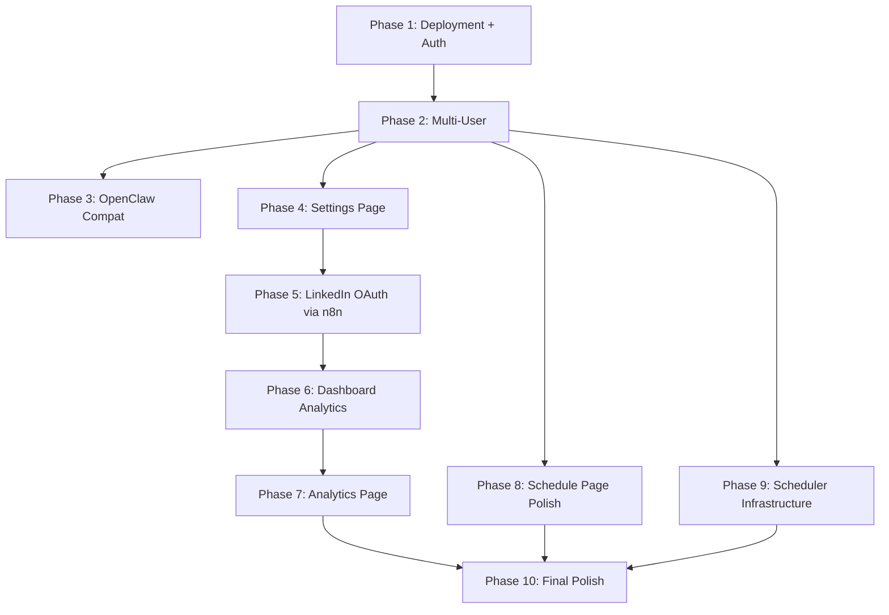

# Linkie Claw — Production Roadmap Overview

## Current Architecture Snapshot

| Layer | Technology | Status |
|-------|-----------|--------|
| **Frontend** | Next.js 16, React 19, TypeScript 5, Tailwind CSS 4, Shadcn UI | ✅ Working prototype |
| **Backend** | Next.js API routes, Zod validation | ✅ Working |
| **Database** | SQLite (`better-sqlite3`) + Drizzle ORM | ⚠️ Single-user, no `user_id` |
| **AI (Text)** | Anthropic Claude (`claude-sonnet-4-20250514`) | ✅ Working |
| **AI (Images)** | Google Gemini Flash / Replicate FLUX Schnell | ✅ Working |
| **Scheduler** | Python FastAPI + APScheduler + PostgreSQL job store | ⚠️ Crashes after ~3 hours |
| **Publishing** | n8n workflow → LinkedIn API (OAuth 2.0) | ⚠️ Single-user only |
| **Auth** | None | ❌ Not implemented |
| **Deployment** | Local development only | ❌ Not deployed |

---

## Existing Pages & Routes

| Route | Page | Data Source | Status |
|-------|------|-------------|--------|
| `/` | Dashboard | `src/lib/mock-data/stats.ts` (hardcoded) | ⚠️ Mock data |
| `/calendar` | Content Calendar | Real DB via `/api/posts` | ✅ Live |
| `/create` | AI Writer / Studio | Real AI APIs + DB | ✅ Live |
| `/analytics` | Analytics | Sidebar link exists (`disabled: true`) | ❌ Stub |
| `/settings` | Settings | Sidebar link exists (`disabled: true`) | ❌ Stub |

---

## Database Schema (Current — No User Scoping)

**Tables:** `posts`, `generations`

- `posts`: `id`, `title`, `content`, `image_url`, `scheduled_at`, `published_at`, `status`, `linkedin_post_urn`, `error_message`, `created_at`, `updated_at`
- `generations`: `id`, `idea`, `text_variations_json`, `images_json`, `selected_text_id`, `selected_image_id`, `created_at`

> **Critical gap:** No `user_id` column in any table. All data is globally shared.

---

## Key Files Map

```
src/
  app/
    page.tsx                → Dashboard (uses mock data)
    calendar/page.tsx       → Calendar (uses real DB)
    create/page.tsx         → AI Writer (uses real AI + DB)
    layout.tsx              → Root layout (no auth wrapper)
    api/
      posts/route.ts        → GET/POST posts
      posts/[id]/route.ts   → GET/PATCH/DELETE single post
      posts/[id]/schedule/  → POST schedule a post
      posts/[id]/unschedule/→ POST unschedule
      generate/text/        → AI text generation
      generate/image/       → AI image generation
      webhooks/publish-status/ → n8n callback
  components/
    layout/sidebar.tsx      → Navigation (Analytics/Settings disabled)
    layout/user-card.tsx    → Hardcoded "Alex Rivera" identity
    dashboard/stats-row.tsx → Uses mock getDashboardStats()
    dashboard/follower-chart.tsx → Uses mockChartHeights
    calendar/calendar-day.tsx → Post cards with hover tooltips
  lib/
    db/schema.ts            → Drizzle schema (posts, generations)
    db/queries.ts           → All DB queries (no user_id filtering)
    mock-data/stats.ts      → Hardcoded stats & charts
    mock-data/posts.ts      → Hardcoded posts & drafts
    mock-data/generations.ts→ Hardcoded AI variations
    queries/stats.ts        → Returns mock data with fake delays
scheduler/
  app/main.py               → FastAPI entry + APScheduler lifespan
  app/scheduler.py           → BackgroundScheduler with PG job store
  app/jobs.py                → trigger_linkedin_publish with retries
  app/routes/schedule.py     → create/cancel/reschedule/get schedule
  docker-compose.yml         → scheduler + postgres + n8n
```

---

## Phase Dependency Order

The 10 phases MUST be executed in this sequence due to hard dependencies:



| Phase | Depends On | Why |
|-------|-----------|-----|
| 1. Deployment + Auth | — | Foundation for everything |
| 2. Multi-User | Phase 1 | Needs auth to scope data per user |
| 3. OpenClaw Compat | Phase 2 | Needs final page structure to annotate |
| 4. Settings Page | Phase 2 | Needs user context to store per-user settings |
| 5. LinkedIn OAuth | Phase 4 | Needs settings page for OAuth config UI |
| 6. Dashboard Analytics | Phase 5 | Needs OAuth tokens to call LinkedIn API |
| 7. Analytics Page | Phase 6 | Extends dashboard patterns to dedicated page |
| 8. Schedule Page | Phase 2 | Needs user-scoped posts |
| 9. Scheduler Infra | Phase 2 | Needs user context in scheduler |
| 10. Final Polish | Phases 7, 8, 9 | Audits everything after all features built |

---

## Global Technical Decisions

These decisions apply across ALL phases:

### Database Migration: SQLite → PostgreSQL
- **Why:** SQLite is file-based and cannot run on Vercel's serverless functions. Vercel Postgres (powered by Neon) is the recommended production database.
- **How:** Rewrite `drizzle.config.ts` to target PostgreSQL, update schema imports from `drizzle-orm/sqlite-core` to `drizzle-orm/pg-core`, use `@neondatabase/serverless` or `pg` adapter.
- **When:** Phase 1 (Deployment)

### Authentication: Auth.js v5 (NextAuth v5)
- **Why:** Native integration with Next.js App Router, universal `auth()` function, supports Google/GitHub/Email providers.
- **How:** Install `next-auth@beta`, create `auth.ts` + `auth.config.ts`, add `users` and `sessions` tables, wrap layout with `SessionProvider`.
- **When:** Phase 1 (Deployment)

### Environment Strategy
- **Local dev:** `.env.local` with local DB + local n8n
- **Production:** Vercel environment variables with Vercel Postgres + cloud n8n
- **Secrets:** `AUTH_SECRET`, `LINKEDIN_CLIENT_ID`, `LINKEDIN_CLIENT_SECRET`, `N8N_CALLBACK_SECRET`, `DATABASE_URL`

### n8n Hosting
- **Current:** Local Docker Compose
- **Production:** Self-hosted on a VPS (e.g., Railway, Render, DigitalOcean) with persistent storage, accessed via public URL
- **Why:** n8n needs to be reachable from LinkedIn OAuth redirects and from Vercel serverless functions

---

## Conventions for the AI Executor

1. **Always work in feature branches** — never push directly to `main`
2. **Run `npm run typecheck` after every schema/type change** — catch type errors early
3. **Run `npm run lint:fix` before committing** — keep code clean
4. **Test in the browser after every visual change** — verify UI renders correctly
5. **Use `data-testid` attributes** on all interactive elements from Phase 3 onward
6. **Preserve the existing design language** — Aurora backgrounds, glass cards, primary color scheme, Plus Jakarta Sans font
7. **Every API route must validate the authenticated user** from Phase 1 onward
8. **Every DB query must filter by `user_id`** from Phase 2 onward
